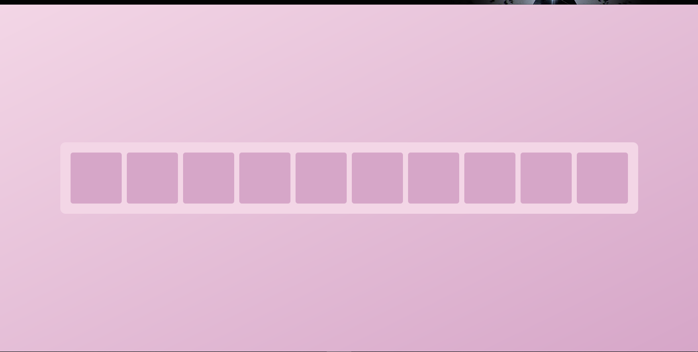
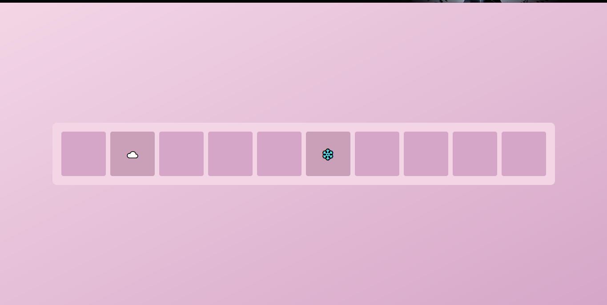
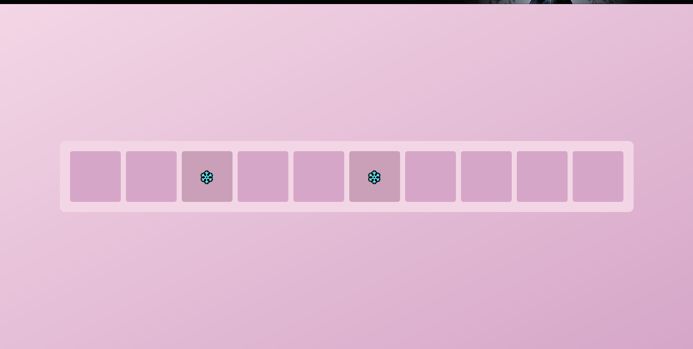
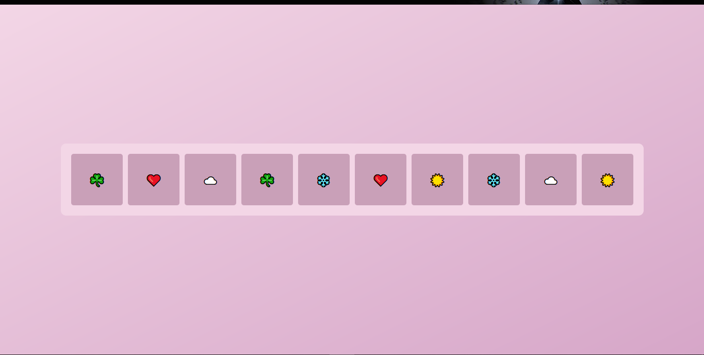
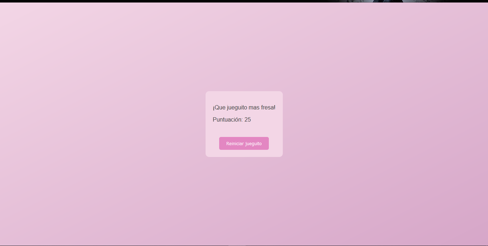

# GameCard

https://alvinrhd.github.io/GameCard/
El juego inica mostrandote en que posición están las cartas, previamente a esto las cartas se ocultan.

Se trata de descubrir todas las cartas para obtener una puntuación.

Dependiendo en cuantas te equivocaste y a las cuantas veces le atinaste, será tu puntuación.

